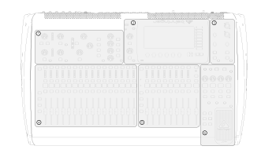
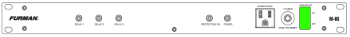
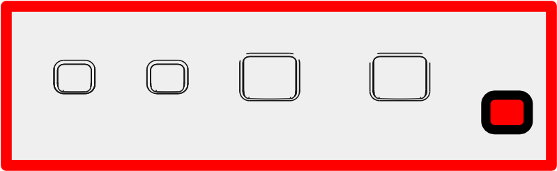
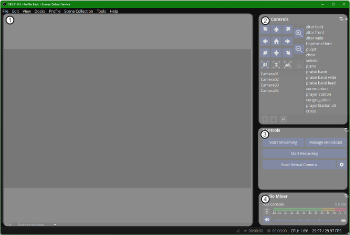

# Soundboard Layout

1. Configuration
2. Display
3. Monitor
4. Inputs
5. Common
6. Scenes and Groups
---
# Audio On
- Remove the cover from the soundboard.
- Switch the power toggle to on 
- Go to the Sacristy
- Switch the amp rack on 
- Go to the sound board.
---
- Press the VIEW button in the scence section of the sound board. 
- Select the scence 00 default
- Push the knob for Go
- Bring the slider marked MAIN to zero 
---
# Audio Off
- Select the Default scene
- In the Sacristy, switch thethe power toggle to off
- Switch the power toggle off at the av booth
- Place the cover over the soundboard
---
# Presentation On
- Power on the Prensentation PC
- Power on the Projector with its labeled remote
- Power on the TV with its remote
- On the Presentation PC enter the 4 digit code **6580**. If an input box does not appear shake the mouse, or press the sapce bar.
- Start the apps from the taskbar.
    - OBS *Occasionaly OBS will ask to start normally or in safe mode. Select noramlly.*
    - Presenter *Presenter may ask to login* **provide a generic login**
---
# Presentation Off
- Close all open applications on the Presenter PC
- On the Projector remote press the StandBy button two times
- On the TV remote press the Power button
- Shut down the Presentor PC through the Start menu
    - Start menu
    - Press the Power button
    - Press Shutdown from the pop up menu
---
# Streaming On
- Power on the Streaming PC
- From the task bar start OBS
---
# Streaming Off
- Close all open apps on the Streaming PC
- Power off the cameras
- Shut down the Presentor PC through the Start menu.
    - Start menu
    - Press the Power button
    - Press Shutdown from the pop up menu
---
# OBS Main Screen
- There are four sections in the main screen of OBS 
  1. Preview
  2. Camera Controls
  3. Preset Positions
  4. Stream Controls
  5. Audio
---
# Streaming Setup
- Ensure OBS is running
- Press the Manage Broadcast button
- A modal will appear
- Press the Create New Broadcast tab
- Enter the Date and time of the service in Title field
- Scroll to the bottom of the modal
- Set the date and time of the service
- Press the Schedule Broadcast button
- Press the Confirm in the Conformation dialog
- Repeat the previous step for each service
---
## Start Stream
- Press the Manage Broadcast button
- A modal will appear
- Press the Select Existing Boradcast tab
- Select the service to stream
- Press the Select Broadcast button
- Press the Start Streaming button

## Stop Stream
- Press the Stop Streaming button
- Press the Confirm button in the confirmation dialog
---
# Camera setup
There are two ways to turn the cameras on and off
1. Use the remote labeled Camera.
 - Point the remote at the cmaera and push the power button
 - repeat for each camera
2. Use the stream deck
 - You should see two buttons one for power on and off.
 - Push the power on button
---
## Camera Controls
To change the position of a camera
- Select a camera from the camera list
- Double click on the posiiton in the position list and the camera will move to that position
---
## Multiview
- Ensure the Multiview is open on the right side screen. It will show all four cameras.
    - Open the Multiview by going through the top menu of OBS
    - View -> Multiview (Fullscreen) -> Selct the second option
- Each of the four cameras will appear
- Press the camera to select
- The selected camera has a red border
---
## Camera select and overlays
Using the stream deck you can switch cameras and toggle the text and slide overlays.
- change to Page two onthe stream deck by pushing the button to the right of the clock
- The overlays are toggled by pressing the button for text, slide and center (buttons 1-3).
- The fourth button in the top row will switch to a full screen of the slides.
- The second row of buttons will change the selcted camera when pushed. It should show cameras 1-4. (buttons 5-8)