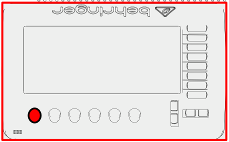
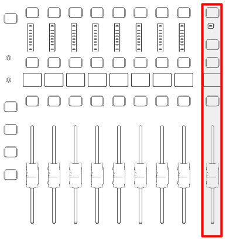
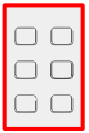

# Audio

## Power On
- Remove the cover from the soundboard.
- Switch the power toggle on 

## Select Scene
- Press the **VIEW** button in the **SCENCES** section of the sound board. 
- Select scence 07 named **Service** 
- Press the button label **GO**
- Press the button labeled **Confirm**
- Bring the slider marked MAIN to zero 

## Mute Groups

The mute groups are at the bottom right corner of the X32 Console. Each button is labeled. The top 4 buttons control microphones and instruments. 
The bottom 2 control the speakers for the Gathering Space and Choir Loft.

# Power Off

- Press the **VIEW** button in the **SCENCES** section of the sound board.
- Select scence 07 named **Service** 
- Press the button label **GO**
- Press the button labeled **Confirm**
- Switch the power toggle off 
- Place the cover over the soundboard