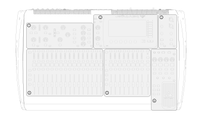
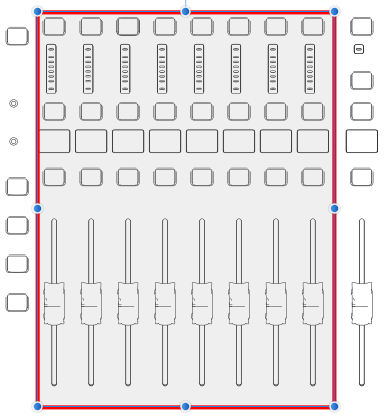
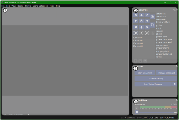
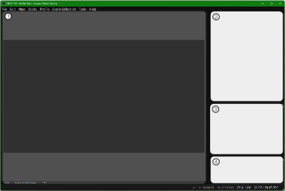
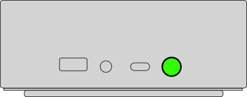
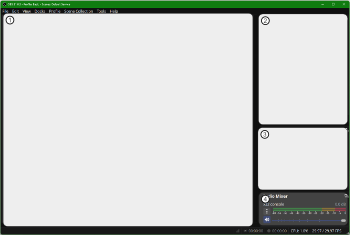
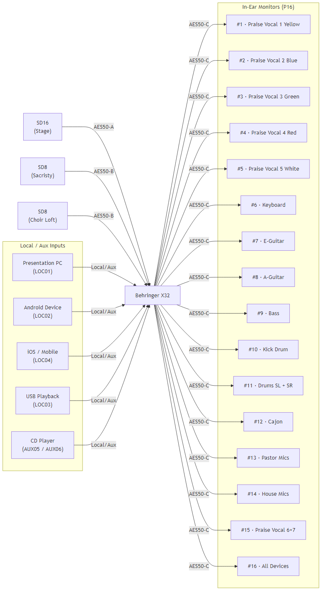
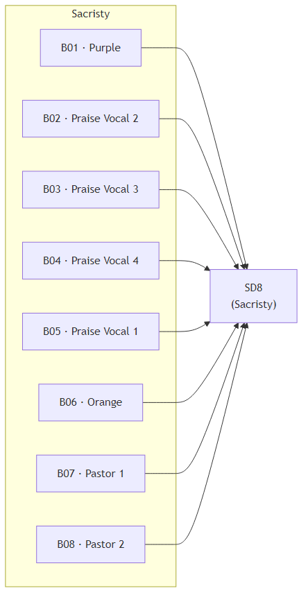
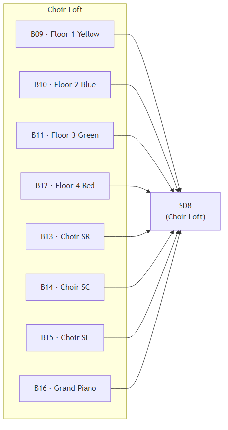
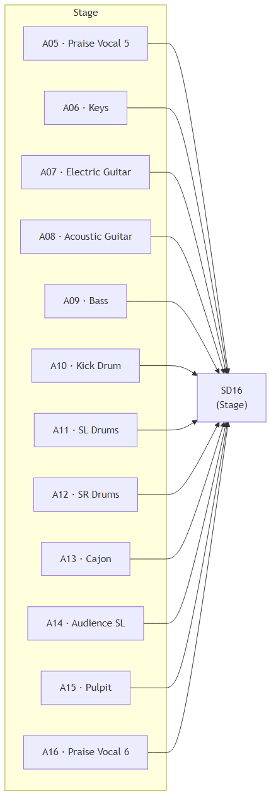

<!-- TOC-START -->
\tableofcontents
<!-- TOC-END -->

\newpage

# Introduction

This guide covers the complete operation of the audio-visual system used during worship services.
It is written for volunteers who operate the sound board, cameras, presentation, and streaming equipment.

**This guide covers:**

- Equipment identification and location
- System startup procedure
- Audio adjustments during service (faders, mute groups, in-ear monitors)
- Camera control and switching
- Presentation and slide display
- Live streaming setup and operation
- System shutdown procedure

> **A note before you begin:** Follow the startup steps in order. Powering things on out of sequence can
> cause audio feedback or a blank stream. When in doubt, restart from the top of the checklist.

\newpage

# System Startup

Follow these steps **in order** at the beginning of each service day.

## 1 — Uncover the Sound Board

Remove the cover from the X32 mixing console.

## 2 — Power On the Audio System

1. Locate the power conditioner (Furman unit) on the equipment rack below the X-32 board.
2. Flip the **power toggle** to the ON position.

   {width=60%}

3. When the X32 has booted nmute the **MAIN** and bring the fader up to **0 dB** (unity).
   {width=60%}

## 3 — Power On the Projector

1. Use the Panasonic projector remote.
2. Press the **Power** button once. The projector will warm up for about 30 seconds.

## 4 — Power On the Confidence Monitor

1. Use the Samsung remote.
2. Press the **Power** button on the TV above the main door.

## 5 — Power On the Presentation Computer

1. Press the power button on the **Presentation** mini PC.
2. Enter PIN **6580** at the login screen. *(If no input box appears, shake the mouse or press the spacebar.)*
3. From the taskbar, open **NDI Screen Capture**.
4. From the taskbar, open **Presenter**. *(Presenter may prompt for login: `av@allshepherds.org`)*
5. Check screen configuration — see [Configure Screens](#configure-screens).

## 6 — Power On the Broadcast Computer

1. Press the power button on the **Broadcast** tower PC.
2. Enter PIN **6580** at the login screen.
3. From the taskbar, open **OBS**. Press **OK** if a plugin error message appears.

## 7 — Power On the Cameras

Use the Stream Deck to power on all four cameras:

1. On the Stream Deck, press the **arrow button** to the right of the clock to go to the camera page.
2. Press the **Camera Power On** button.

   {width=50%}

3. Verify the multiview screen on the right monitor for broadcast computer shows all four cameras.

   {width=80%}

## 8 — Distribute Microphones

- **Pastor's mic pack** — Place the mic on to the body pack, and put the body pack in the belt popuch. Place the belt pouch onb the counter in the Sacristy.
- **Handheld mics:**
  - **Orange** mic → choir loft
  - **Purple** mic → mic stand by baptismal font
  - Remaining mics → praise band stage

## 9 — Streaming Setup

See the [Streaming](#streaming) section to schedule and prepare the stream before service begins.

\newpage

# Service Operations

This section covers audio mixing, camera control, presentation, and streaming operations during the service.

\newpage

## Audio Operations

### The X32 Console Sections

The top of the X32 has four main sections you will use during service:

{width=90%}

### DCA Faders

DCAs (Digitally Controlled Amplifiers) are master volume controls that groups multiple channels.
Use DCAs for quick level adjustments without touching individual channel faders.

{width=70%}

| DCA | Label | What It Controls |
|---|---|---|
| DCA 1 | Pastor Craig | Pastor Craig's wireless lavalier |
| DCA 2 | Pastor Wendy | Pastor Wendy's wireless lavalier |
| DCA 3 | Purple | Purple handheld mic (baptismal font) |
| DCA 4 | Orange | Orange handheld mic (choir loft) |
| DCA 5 | Pulpit | Pulpit microphone |
| DCA 6 | Projector | Presentation / projection audio |
| DCA 7 | Choir | Choir overhead microphones (CH26–28) |
| DCA 8 | Device | All playback devices (BUS12) |

> **Tip:** During a pastor's message, raise DCA 1 or DCA 2. During music.

### Mute Groups

Mute groups let you silence an entire section with a single button press. They are located in the
bottom-right corner of the X32 console.

{width=60%}

| Group | Label | Silences |
|---|---|---|
| MG 1 | Praise Vocals | All praise vocal microphones |
| MG 2 | Praise Instruments | All praise band instruments |
| MG 3 | Floor Mics | Floor pocket microphones (CH17–20) |
| MG 5 | Gathering Space | Speakers in the gathering/narthex area |
| MG 6 | Choir | Speakers in the choir loft |

> **Note:** A lit mute button means that group **is muted** (silent). Press again to un-mute.

### Praise Band Channel Strips

The praise band occupies channels 1–13. Use the channel faders to balance individual instruments.

### Adjusting Levels During Service

| Situation | Action |
|---|---|
| A pastor's mic is too quiet | Raise the corresponding DCA fader (DCA 1 or 2) |
| A pastor's mic is feeding back | Lower the DCA immediately, then slightly reduce the channel's gain or EQ |
| Vocals are too loud in the sanctuary | Lower MG 1 briefly or reduce individual vocal faders |
| Band is overpowering vocals | Lower individual instrument channel faders |
| No audio from presentation/video | Check DCA 6 is raised; verify Presentation PC is sending audio |
| Gathering space is too loud | Lower or mute MG 5 |

### In-Ear Monitors

The **Behringer P16-M** personal monitor mixers are used by musicians on stage.
Each musician controls their own mix on their unit.

The P16 receives its input signals from the X32 via an AES50 network connection.
The channel mapping is:

| P16 Ch | Label | Source |
|---|---|---|
| PM 01 | Praise Vocal 1 (Yellow) | CH01 |
| PM 02 | Praise Vocal 2 (Blue) | CH02 |
| PM 03 | Praise Vocal 3 (Green) | CH03 |
| PM 04 | Praise Vocal 4 (Red) | CH04 |
| PM 05 | Praise Vocal 5 (White) | CH05 |
| PM 06 | Keyboard | CH06 |
| PM 07 | Electric Guitar | CH07 |
| PM 08 | Acoustic Guitar | CH08 |
| PM 09 | Bass | CH09 |
| PM 10 | Kick Drum | CH10 |
| PM 11 | Drums (SL + SR) | BUS08 |
| PM 12 | Cajon | CH12 |
| PM 13 | Pastor Mics | BUS09 |
| PM 14 | House Mics | BUS10 |
| PM 15 | Praise Vocal 6 & 7 | BUS11 |
| PM 16 | All Devices | BUS12 |

> **Tip:** If a musician cannot hear themselves, check that their P16 unit is powered on and that
> its own channel fader for their instrument is raised.

\newpage

## Video & Camera Operations

### OBS Layout

When OBS is open, you will see the main window with controls on the left and the multiview monitor on the right.

{width=90%}

### Multiview

The **Multiview** screen shows all four cameras at once on the right monitor.
The active (live) camera is highlighted with a **red border**.

{width=80%}

**To switch the active camera:**
Left-click the desired camera image in the Multiview window.

#### Open Multiview (if not visible)

1. Ensure OBS is open.
2. From the menu, select **View → Multiview (Fullscreen) → R240HY2**.

### Previewing a Camera

The preview panel in OBS shows what the next camera looks like before you switch to it live.

{width=70%}

### OBS Controls Panel

The controls panel sits in the lower-right area of OBS.

{width=50%}

### PTZ Camera Control

Camera position (pan, tilt, zoom) is controlled within OBS using the **PTZ Controls** dock.

{width=50%}

The PTZ dock has three sections:

1. **Camera List** — Click once to select a camera.
2. **Position Presets** — Double-click a preset to move the camera to that position.
3. **Manual Position** — Use the directional pad to pan/tilt; zoom controls are on the right.

   {width=60%}

#### Available Camera Presets

Most cameras share the same preset list. The most-used presets are at the top:

- Altar (back, front, wide)
- Baptismal font
- Pulpit
- Choir
- Soloist
- Piano
- Praise band (front, wide, lead)
- Communion
- Prayer station
- Congregation

{width=60%}

> **Tip:** A short click on a PTZ control button produces a small movement.
> Holding the button produces a longer, continuous movement.

### Stream Deck

The **Stream Deck Neo** sits on the operator table and provides quick one-touch buttons.

{width=60%}

**Camera page** (press the right-arrow button next to the clock to switch to this page):

{width=40%}

| Button row | Function |
|---|---|
| Top row, button 3 | Toggle **Text** overlay |
| Top row, button 4 | Toggle **Slide** overlay |
| Top row, button 5 | Toggle **Center** overlay |
| Top row, button 6 | **Full-screen** slide view |
| Bottom row, buttons 1–4 | Switch to Camera 1, 2, 3, or 4 |

#### Overlay Types

**Text overlay** — lower-third text bar:

{width=70%}

**Slide overlay** — slides shown in a side panel:

{width=70%}

**Center overlay** — slides shown in the center:

{width=70%}

**Full-screen slide view:**

{width=70%}

\newpage

## Presentation

### Presentation Computer

The Presentation PC runs **Presenter by Worship Tools**, which displays lyrics, readings, and videos
on the main projection screen and the stage confidence monitor.

{width=50%}

### Starting Presenter

1. Open **Presenter** from the taskbar (icon looks like a green "P").
2. If prompted to log in, use: `av@allshepherds.org`.

   {width=80%}

### Presenter Layout

The Presenter window has three main areas:

{width=80%}

- **Services list** (left) — Select the service for today.
- **Cue list** (center) — Each cue is a step in the service (hymn, reading, video, etc.).
- **Slide preview** (right) — Shows the current slide.

### Running a Service

1. Select today's service from the **Services** list on the left.
2. Click the **first cue** in the cue list to begin.
3. Navigate with the keyboard:
   - **Right arrow** — next slide (advances to next cue after the last slide)
   - **Left arrow** — previous slide
   - **Down arrow** — skip to next cue
   - **Up arrow** — go to previous cue

### Countdown Timer

Before the 11:11 service, display a countdown on the screen:

1. Press **F6**, or from the top menu select **More → Countdown**.
2. From the **Template** dropdown, choose **11:11 Countdown**.
3. Press the **Start** button at the bottom of the dialog, then close it.

The countdown will automatically disappear at 11:11.

### Configure Screens {#configure-screens}

Run this check every startup to confirm slides appear on the correct displays.

1. In Presenter, click the **monitor icon** in the top-right corner.

   {width=40%}

2. Select **Configure** → **Screen Configuration**.

   {width=70%}

3. Assign outputs:

   | Output | Display | Notes |
   |---|---|---|
   | Main Audience Output | Display 3 | Projector |
   | Stage Display | Display 1 | Confidence monitor (large TV) |
   | Broadcast | Display 2 | Monitor on right (feeds to stream) |

4. Press **Save** after each assignment.
5. To exit, click a cue in the list — slides will appear on the displays.

### NDI Screen Capture

NDI Screen Capture sends the presentation output over the network to OBS on the Broadcast PC.
It should launch automatically from the taskbar. If the stream shows a blank slide area,
restart NDI Screen Capture from the taskbar.

{width=40%}

\newpage

## Streaming

### Audio Levels for Streaming

The streaming audio comes from BUS03 on the X32. Use this path to adjust streaming audio
independently of the sanctuary speakers.

### Schedule a Broadcast

Do this **before service starts** so the stream is ready to go live on time.

1. In OBS, click **Manage Broadcast**.

   {width=60%}

2. In the modal that appears, click the **Create New Broadcast** tab.
3. In the **Title** field, enter the date and time of the service (e.g., *March 22, 2026 — 11:11 AM*).
4. Scroll to the bottom and set the date and time of the service.
5. Press **Schedule Broadcast**, then press **Confirm**.
6. Repeat for each service if there are multiple streams that day.

### Start the Stream

1. In OBS, click **Manage Broadcast**.
2. Click the **Select Existing Broadcast** tab.
3. Select the service from the list.
4. Press **Select Broadcast**.

   {width=60%}

5. Press **Start Streaming**.

   {width=60%}

   > **Important:** Confirm you see "LIVE" in the OBS status bar at the bottom before walking away.

### Stop the Stream

1. In OBS, press **Stop Streaming**.
2. Press **Confirm** in the confirmation dialog.

### OBS Audio Monitor

Use the OBS audio mixer to verify all audio sources are active and at healthy levels during the stream.

{width=80%}

\newpage

# System Shutdown

Follow these steps **in order** at the end of each service.

## 1 — Return Microphones

- Return the **pastor's mic pack** to its charger.
- Return the **Orange** handheld mic to the choir loft charger.
- Return the **Purple** handheld mic to the baptismal font mic stand charger.
- Return all remaining handheld mics to their charging stations.

## 2 — Power Off Cameras

1. On the Stream Deck, navigate to the camera page (right-arrow button).
2. Press the **Camera Power Off** button. Cameras will pan to face the wall.

   {width=40%}

## 3 — Close OBS and Shut Down Broadcast Computer

1. In OBS, close the application (File → Exit).
2. Shut down the Broadcast PC: **Start → Power → Shut down**.

## 4 — Close Presenter and Shut Down Presentation Computer

1. Close all open applications in Presenter.
2. Power off the **confidence monitor** (large TV above the back door) using its remote.
3. Power off the **projector** using the Panasonic remote — press the **Standby** button **twice**.
4. Shut down the Presentation PC: **Start → Power → Shut down**.

## 5 — Power Off Audio Board

1. P Switch the **power toggle** on the Furman conditioner to OFF.

   {width=60%}

## 6 — Cover the Sound Board

Place the protective cover back over the X32 console.

\newpage

# Technical Reference

This section contains detailed configuration tables for troubleshooting and system setup.
You do not need to memorize these during normal operation.

## System Audio Map

{width=100%}

## Stage Box Device Maps

### Sacristy (SD8)

{width=70%}

### Choir Loft (SD8)

{width=70%}

### Stage (SD16)

{width=90%}

## Equipment Overview

The table below lists every piece of equipment in the system with its label and role.

### Audio Equipment

| Item | Label | Role |
|---|---|---|
| Behringer X32 | X32 | Main digital audio mixing console |
| Behringer SD16 | SD16 | 16-input stage box — Stage (A01–A16) |
| Behringer SD8 (×2) | SD8 | 8-input stage boxes — Sacristy (B01–B08) and Choir Loft (B09–B16) |
| Behringer P16-M (×9) | P16 | Personal in-ear monitor mixers for musicians |
| Crown XTi 6002 Amplifier | Crown 6002 | Powers sanctuary main speakers |
| Crown XTi 1002 Amplifier | Crown 1002 | Powers gathering space and choir speakers |
| JBL CBT-1000 (×2) | Main Speaker | Sanctuary main speakers |
| JBL CBT50LA-1 (×4) | Side Speaker | Narthex and choir speakers |
| Shure SLXD24/B87 Wireless Vocal Mic (×6) | B87 | Handheld wireless vocal microphones |
| Shure SLXD14/MX153T Wireless Lavalier (×2) | MX153T | Wireless clip-on microphones for pastors |
| Shure UA844+SWB Antenna Distribution (×2) | UA844 | Distributes antenna signal for wireless mics |
| Shure SM58 (×4) | SM58 | Wired vocal microphone |
| Shure SM57 (×3) | SM57 | Wired instrument microphone |
| Shure CVO Overhead Condenser (×3) | CVO | Overhead choir microphones |
| Xvive U45 IEM Wireless Transmitter (×6) | U45T | Sends monitor mix to in-ear packs |
| Xvive U45 IEM Wireless Receiver (×12) | U45R | Wireless in-ear monitor belt packs |
| Xvive U2 Wireless Guitar System | U2 | Wireless guitar transmitter and receiver |
| Peavey USB-P Playback Device | USBP | USB audio playback |
| Radial USB-Pro Direct Box | USBPro | Stereo USB audio input |

### Video Equipment

| Item | Label | Role |
|---|---|---|
| PTZOptics 20X-NDI Camera (×4) | 20XNDI | Remote-controlled PTZ cameras over NDI |
| Beelink EQR6 Mini PC | Presentation PC | Runs Presenter (slides) and NDI Screen Capture |
| SkyTech Blaze II Gaming PC | Broadcast PC | Runs OBS for live streaming and camera switching |
| Panasonic PT-RZ970LBU7 Projector | Projector | Projects slides to the main sanctuary screen |
| Screen Innovations 165" Fixed Frame | Screen | Main projection screen in sanctuary |
| Samsung QB98R 98" Display | Confidence Monitor | Stage confidence monitor above the back door |
| Acer 23.8" Monitor (×4) | Monitor | Operator monitors |
| Elgato Stream Deck Neo | Stream Deck | One-touch camera switching and overlay control |
| J-Tech HDMI Extender | — | Extends HDMI signal over Cat6 cable |
| Wavlink USB-C Quad Monitor Adapter | — | Drives multiple monitors from Presentation PC |
| Extron DTP HDMI 4K 230 TX | — | Transmits HDMI signal to projector over Cat6 |

## X32 Channel Map

| Channel | Label | Source Device | Wireless | Phantom (48V) |
|---|---|---|:---:|:---:|
| CH 01 | Praise Vocal 1 — Yellow | B05 | ✓ | |
| CH 02 | Praise Vocal 2 — Blue | B02 | ✓ | |
| CH 03 | Praise Vocal 3 — Green | B03 | ✓ | |
| CH 04 | Praise Vocal 4 — Red | B04 | ✓ | |
| CH 05 | Praise Vocal 5 — White | A05 | | |
| CH 06 | Keys | A06 | | |
| CH 07 | Electric Guitar | A07 | | |
| CH 08 | Acoustic Guitar | A08 | | |
| CH 09 | Bass | A09 | | |
| CH 10 | Kick Drum | A10 | | |
| CH 11 | Drums SL | A11 | | |
| CH 12 | Drums SR | A12 | | |
| CH 13 | Cajon | A13 | | |
| CH 14 | Praise Vocal 6 | A16 | | |
| CH 15 | Praise Vocal 7 | — | | |
| CH 16 | Grand Piano | B16 | | |
| CH 17 | Floor Mic 1 — Yellow | B09 | | |
| CH 18 | Floor Mic 2 — Blue | B10 | | |
| CH 19 | Floor Mic 3 — Green | B11 | | |
| CH 20 | Floor Mic 4 — Red | B12 | | |
| CH 21 | Pastor Craig | B07 | ✓ | |
| CH 22 | Pastor Wendy | B08 | ✓ | |
| CH 23 | Purple | B01 | ✓ | |
| CH 24 | Orange | B06 | ✓ | |
| CH 25 | Pulpit | A15 | | ✓ |
| CH 26 | Choir SR | B13 | | ✓ |
| CH 27 | Choir SC | B14 | | ✓ |
| CH 28 | Choir SL | B15 | | ✓ |
| CH 31 | Audience SR | Aux2/Local3 | | ✓ |
| CH 32 | Audience SL | A14 | | ✓ |

## Aux Inputs

| Channel | Label | Source |
|---|---|---|
| AX 01 | Presentation PC | Local 01 |
| AX 02 | Device | Local 02 |
| AX 03 | Audience SR | Local 03 |
| AX 04 | Mobile | Local 04 |
| AX 05 | CD | AUX 05 |
| AX 06 | CD | AUX 06 |

## Bus Sends

| Bus | Label | Source Channels |
|---|---|---|
| BUS 01 | Choir | |
| BUS 02 | Gathering | |
| BUS 03 | Streaming | |
| BUS 08 | Drums SL+SR | CH 11, 12, 13 |
| BUS 09 | Pastor Mics | CH 21, 22 |
| BUS 10 | Other Mics | CH 17, 18, 19, 20, 23, 24, 25 |
| BUS 11 | Praise Mics 6 & 7 | CH 14, 15 |
| BUS 12 | All Devices | AUX 1, 2, 4, 5, 6, 7, 8 |

## Stage Box Device Map

The X32 receives inputs from three Behringer stage boxes:

| Stage Box | Location | X32 Inputs |
|---|---|---|
| SD16 | Stage | A01–A16 |
| SD8 (1) | Sacristy | B01–B08 |
| SD8 (2) | Choir Loft | B09–B16 |

Full device map:

| Input | Stage Box | Location | Channel Assignment |
|---|---|---|---|
| A05 | SD16 | Stage | Praise Vocal 5 White |
| A06 | SD16 | Stage | Keys |
| A07 | SD16 | Stage | Electric Guitar |
| A08 | SD16 | Stage | Acoustic Guitar |
| A09 | SD16 | Stage | Bass |
| A10 | SD16 | Stage | Kick Drum |
| A11 | SD16 | Stage | Drums SL |
| A12 | SD16 | Stage | Drums SR |
| A13 | SD16 | Stage | Cajon |
| A14 | SD16 | Stage | Audience SL |
| A15 | SD16 | Stage | Pulpit |
| A16 | SD16 | Stage | Praise Vocal 6 |
| B01 | SD8 — Sacristy | Sacristy | Purple |
| B02 | SD8 — Sacristy | Sacristy | Praise Vocal 2 Blue |
| B03 | SD8 — Sacristy | Sacristy | Praise Vocal 3 Green |
| B04 | SD8 — Sacristy | Sacristy | Praise Vocal 4 Red |
| B05 | SD8 — Sacristy | Sacristy | Praise Vocal 1 Yellow |
| B06 | SD8 — Sacristy | Sacristy | Orange |
| B07 | SD8 — Sacristy | Sacristy | Pastor Craig |
| B08 | SD8 — Sacristy | Sacristy | Pastor Wendy |
| B09 | SD8 — Choir Loft | Choir Loft | Floor Mic 1 Yellow |
| B10 | SD8 — Choir Loft | Choir Loft | Floor Mic 2 Blue |
| B11 | SD8 — Choir Loft | Choir Loft | Floor Mic 3 Green |
| B12 | SD8 — Choir Loft | Choir Loft | Floor Mic 4 Red |
| B13 | SD8 — Choir Loft | Choir Loft | Choir SR |
| B14 | SD8 — Choir Loft | Choir Loft | Choir SC |
| B15 | SD8 — Choir Loft | Choir Loft | Choir SL |
| B16 | SD8 — Choir Loft | Choir Loft | Grand Piano |
