# AV System Operations Guide

This guide is the single runbook for operating the AV system for a service.

Use this order every time:
1. Pre-Service Setup (Startup)
2. During Service (Running)
3. Post-Service Teardown (Shutdown)

---

## 1) Pre-Service Setup (Startup)

### 1.1 Power and Hardware
1. Remove the soundboard cover.
2. Power on the audio system (Furman power toggle).

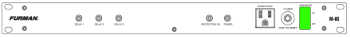

3. Power on the projector and confidence monitor (TV above the door).
4. Power on the Presentation PC and sign in with PIN **6580**.
5. Power on the Broadcast PC and sign in with PIN **6580**.
6. On Stream Deck, power on the cameras.

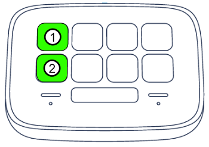

### 1.2 Presentation Computer Setup
1. Open **Presenter** from the taskbar.

2. Open **NDI Screen Capture** from the taskbar.

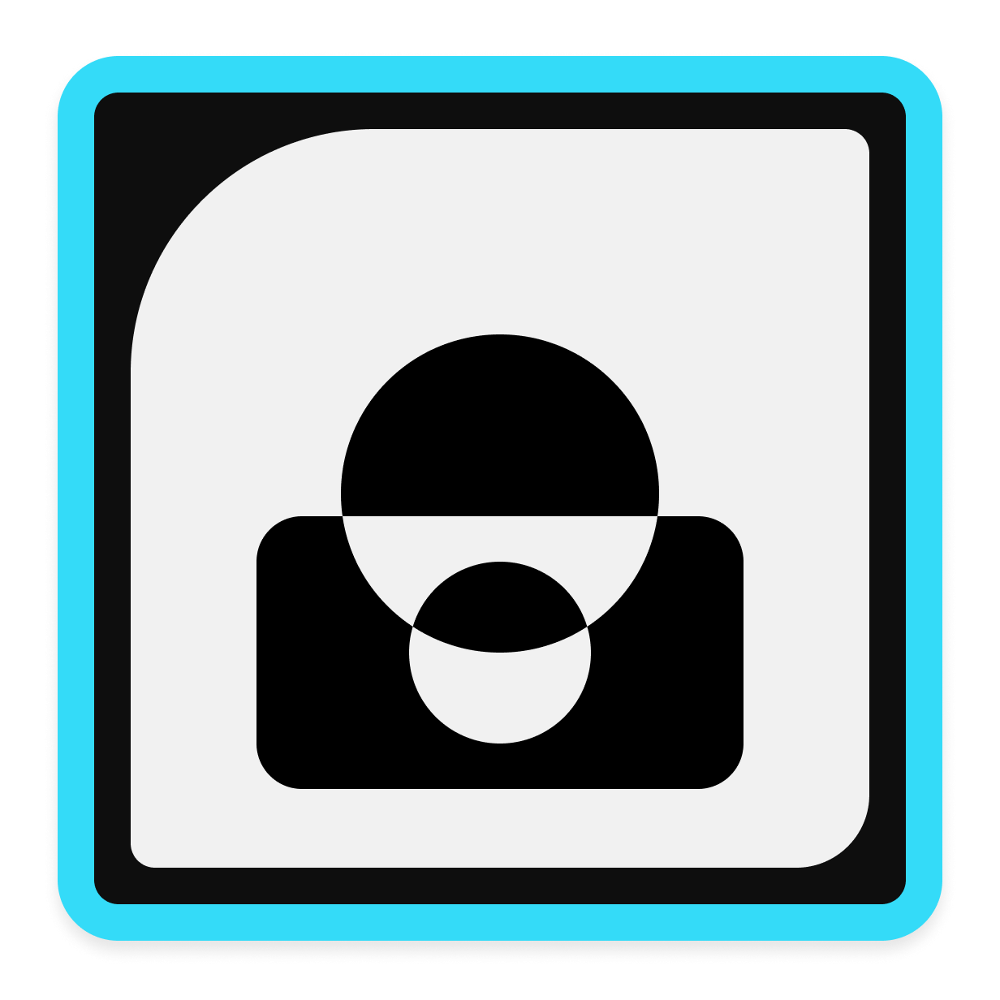

3. In Presenter, open screen configuration:
   - Screen icon (top-right) -> **Configure** -> **Screen Configuration**.

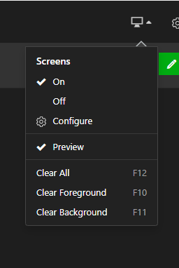

4. Assign displays:
   - **Main Audience Output** -> projector display
   - **Stage Display** -> confidence monitor
   - **broadcast** -> right monitor
5. Save each assignment.

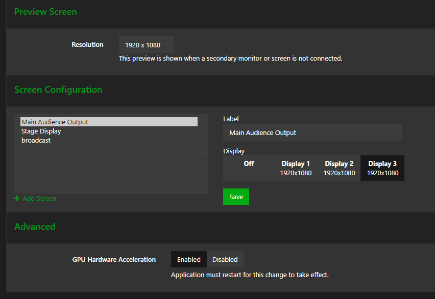

### 1.3 Audio Console Setup (X32)
1. Press **VIEW** in the **SCENES** section.

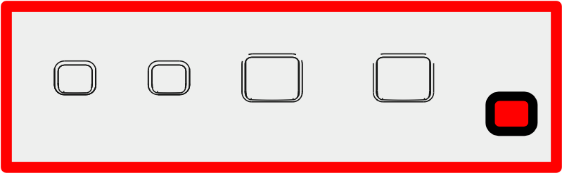

2. Select scene **07 - Service**.

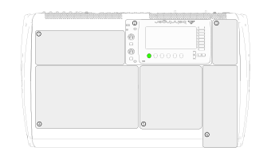

3. Press **GO**.

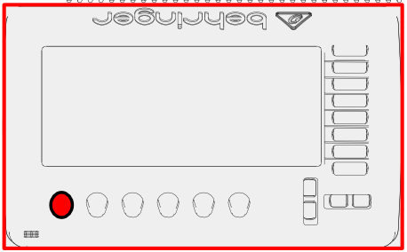

4. Press **Confirm**.

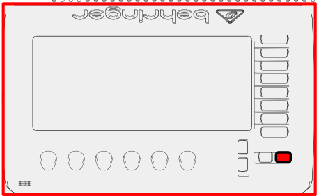

5. Bring the **MAIN** slider to zero (0 dB) as required for service start.

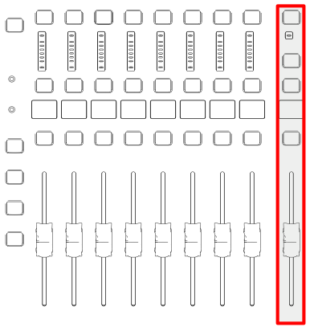

### 1.4 OBS and Broadcast Setup
1. Open **OBS** on the Broadcast PC.

2. Confirm multiview is visible. If not:
   - **View -> Multiview (Fullscreen) -> R240HY2**

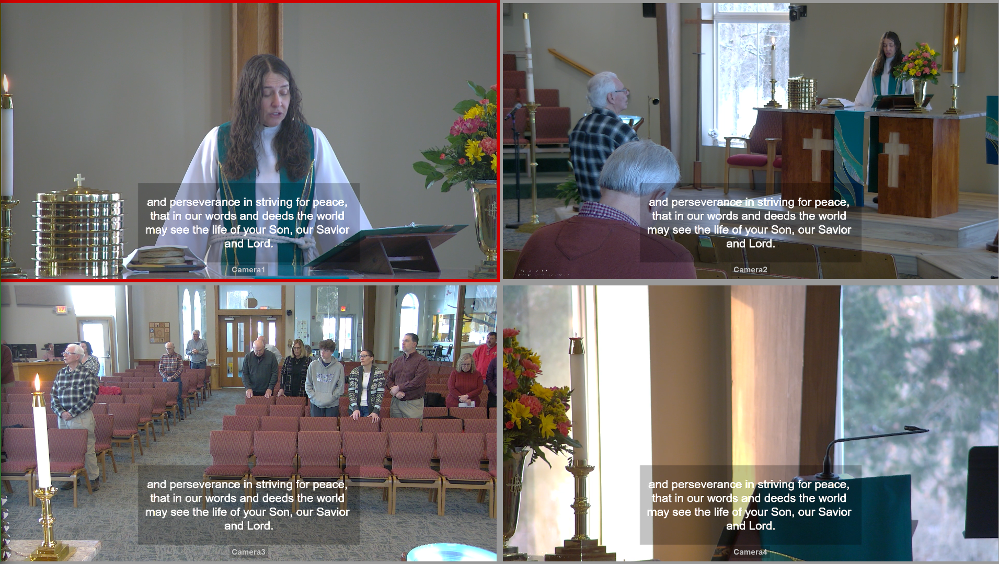

3. Confirm camera controls are available in PTZ dock.

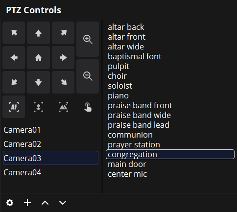

4. Select each camera and verify preset positions.

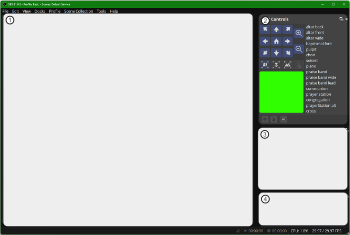

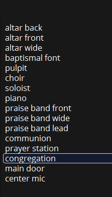

### 1.5 Streaming Setup (Before Service)
1. Ensure **OBS** is running.s
2. In OBS, open **Manage Broadcast**.

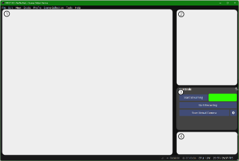

3. In the dialog, select the **Create New Broadcast** tab.
4. Enter the service date and time in the **Title** field.
5. Scroll to the bottom of the dialog.
6. Set the scheduled date and time for the service.
7. Press **Schedule Broadcast**.
8. Press **Confirm** in the confirmation dialog.
9. Repeat these steps for each service that must be scheduled.

### 1.6 Final Pre-Service Checks
- Distribute pastor mic pack.
- Distribute handheld mics:
  - **Orange** -> choir loft
  - **Purple** -> baptismal font stand
  - Others -> praise band stage
- Confirm slide output on projector and confidence monitor.
- Confirm active camera and audio meters in OBS.

---

## 2) During Service (Running)

### 2.1 Presenter Operation
1. Select the correct service in Presenter.

2. Select first cue.
3. Navigate with arrow keys:
   - **Right** = next slide (then next cue)
   - **Left** = previous slide
   - **Down** = next cue
   - **Up** = previous cue

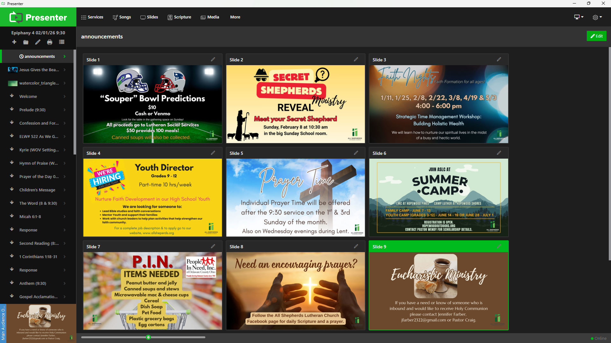

4. If needed, start countdown:
   - **F6** (or More -> Countdown)
   - Template: **11:11 Countdown**
   - Press **Start**

### 2.2 Camera and Scene Control in OBS
1. Watch multiview and click a camera to set preview/program as needed.
2. Use PTZ controls for fine movement and zoom.

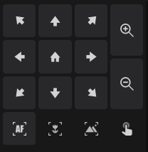

3. Use camera presets for quick framing changes.

### 2.3 Stream Deck Use
1. Use camera buttons to switch camera views.

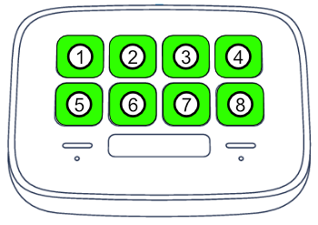

2. Use page navigation if needed.
   - Use the next-page button to move forward.

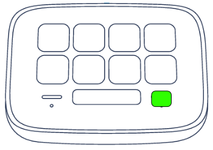

   - Use the previous-page button to move back.

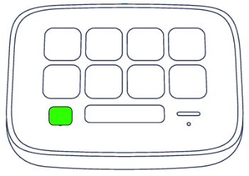

3. Toggle overlays as needed:
   - Text overlay

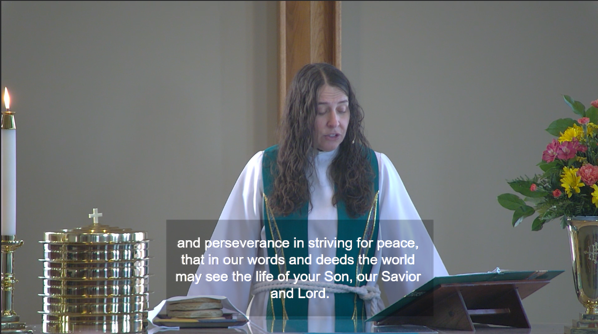

   - Slide overlay

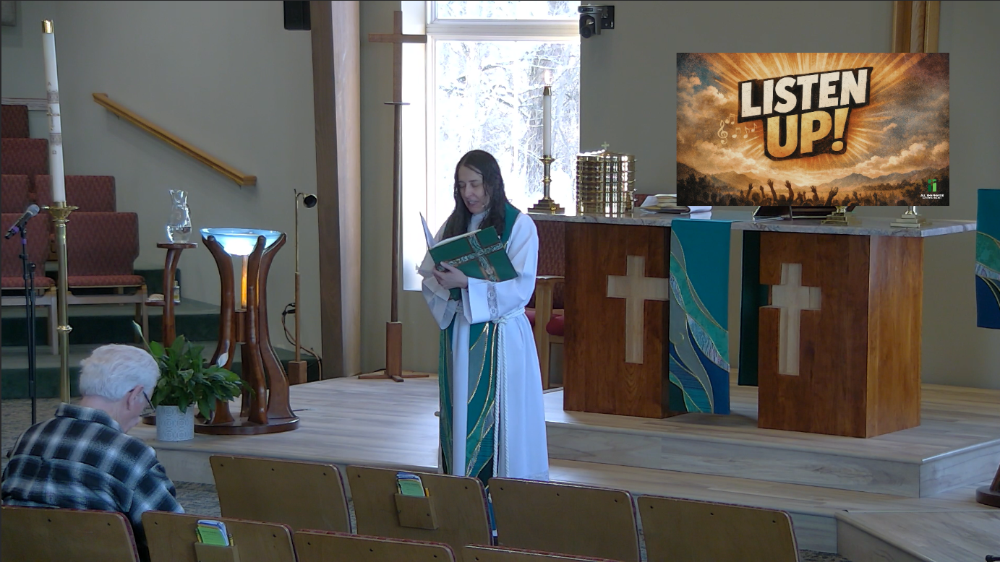

   - Center overlay

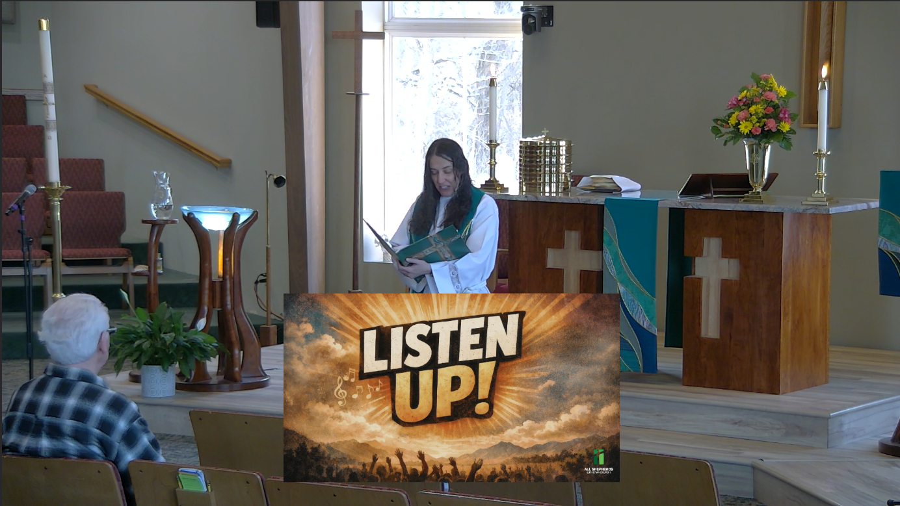

   - Full-screen slide mode

### 2.4 Start and Stop Streaming
1. At service start, select the correct broadcast in **Manage Broadcast**.
2. Press **Start Streaming**.

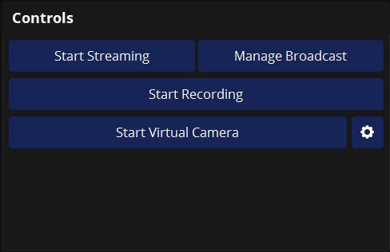

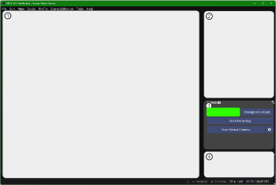

3. At end of service, press **Stop Streaming** and confirm.

### 2.5 Live Audio Notes
- Use mute groups as labeled on X32.
- Top mute groups are for mics/instruments.
- Bottom mute groups control gathering space and choir loft speakers.

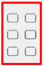

---

## 3) Post-Service Teardown (Shutdown)

### 3.1 Microphones and Immediate Wrap-Up
1. Return handheld mics to charger:
   - **Orange** -> choir loft
   - **Purple** -> baptismal font stand
   - Others -> stage storage/chargers
2. Return pastor mic pack to charger.

### 3.2 Stop Broadcast and Power Down Broadcast Station
1. In OBS, ensure streaming is stopped.
2. Close OBS and other broadcast apps.
3. Power off cameras using Stream Deck.

4. Shut down Broadcast PC from Start menu.

### 3.3 Power Down Presentation Station
1. Close Presenter and all open apps.
2. Power off confidence monitor (TV).
3. Power off projector (standby sequence per remote).
4. Shut down Presentation PC from Start menu.

### 3.4 Power Down Audio Console
1. Press **VIEW** in **SCENES**.

2. Select scene **07 - Service**.

3. Press **GO**.

4. Press **Confirm**.

5. Switch off system power toggle.

6. Replace the soundboard cover.

---

## 4) Quick Troubleshooting

### No projector or confidence monitor output
- Re-open Presenter screen configuration and verify display assignments.
- Re-save assignments and reselect a cue.

### OBS multiview not showing
- Use **View -> Multiview (Fullscreen) -> R240HY2**.

### Camera not framed correctly
- Select camera in PTZ dock, then double-click a preset.
- Use manual pan/tilt/zoom for final adjustment.

### Stream will not start
- Open **Manage Broadcast** and ensure the correct event is selected.
- Confirm network connection and OBS stream controls.

---

## 5) Pre-Flight Checklist (Fast Version)

- Audio powered on, scene 07 loaded, main level set
- Presentation PC on, Presenter + NDI running
- Screen configuration verified
- Broadcast PC on, OBS running, multiview visible
- Cameras powered and presets checked
- Mics distributed
- Broadcast selected and ready to start
